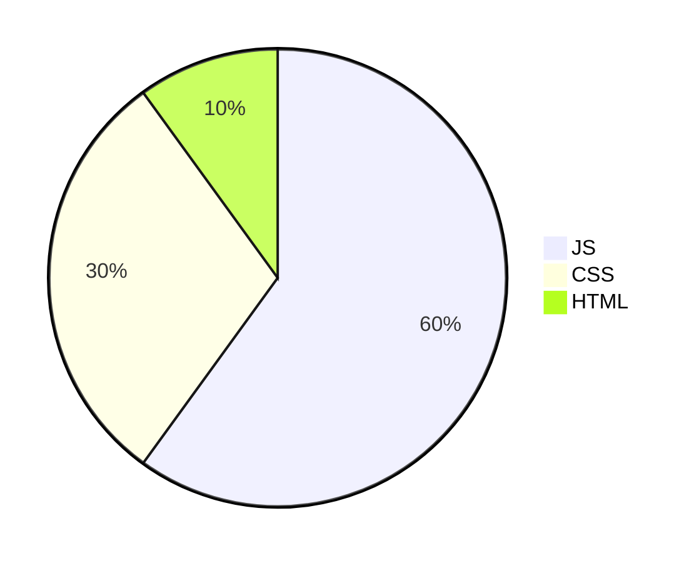
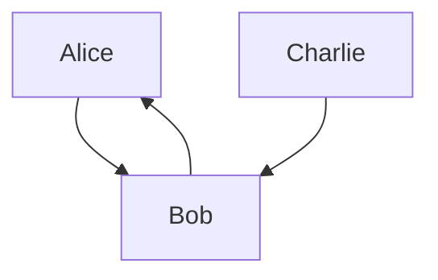

# Markdown Test😶
[Github flavored Markdown Spec](https://github.github.com/gfm/)
### My personal repository
### Heading H1
## Heading H2
# Heading H3
#### **bolding**
#### Italic is not *Italy*
#### Italic is *NOT* Italy *PPractice*
#### This text is really ***important***
> blockquotes with  
> (space if deleted this text)  
>  multiple paragraphs
>> here's a nested blockquotes
>>> and more nested blockquotes

Line breaks with  
**Two spaces after**  

### Paragraph practice
I really like using Markdown.
  
(Separate two paragraph with on or more lines of texts.) 
Paragraph 2. Ithink I'll use it to format all of my documents from now on.

### Ordered List practice
1. one fish
2. two fish
3. three fish
   1. one of three fish is also a fish
   2. two of three fish are fish

### Unordered list 
- hello
 ,
  - world
- !
  
* hello
* ,
* world
* !

+ hello
+ ,
+ world
+ !

### Link
[this is an url to github website](https://docs.github.com/en/get-started/writing-on-github/getting-started-with-writing-and-formatting-on-github/quickstart-for-writing-on-github)  

or directly turn a URL to a link: <https://docs.github.com/en/get-started/writing-on-github/getting-started-with-writing-and-formatting-on-github/quickstart-for-writing-on-github>  

or email: <abc@abc.com>
### Image

*A pretty new wallpaper here😀*  
</br></br>
<figure>
  </br>
  <figcaption>A random img here.😶‍🌫️ </figcaption>
</figure>
</br>

### Table
<details>
<summary>my top languages</summary>
  
| Rank | Language      |
|:----:|:--------------|
|     1| C             |
|     2| Python        |
|     3| SQL           |

<!--Example of a comment -->
</details>
</details>
</details>
</br>

|Command|Description|
|---|---|
|'git status'|List all *new* files|
|'git diff'|Show file defferences that **haven't been** stages|
</br>

|Left-aligned⬅️|Centered-aligned😇|Right_aligned➡️|
|:---|:---:|---:|
|On the left|At the center|On the right|

</br>

<!-- leave blank space -->
<!--This is a fenced code blocks-->

</br>


</br>

```C
#include <stdio.h>
printf("Hello, world!");
```


